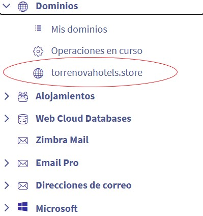
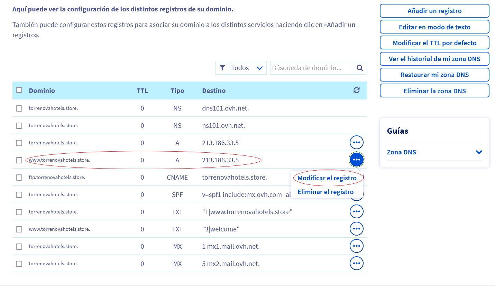
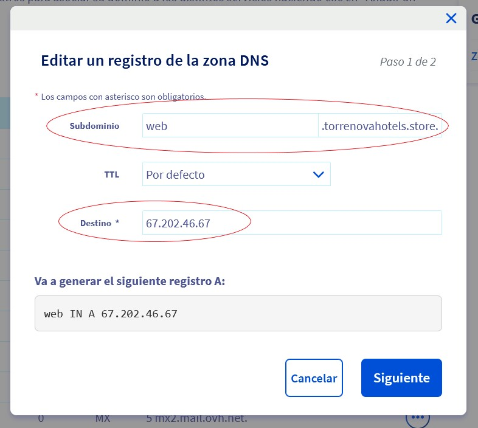
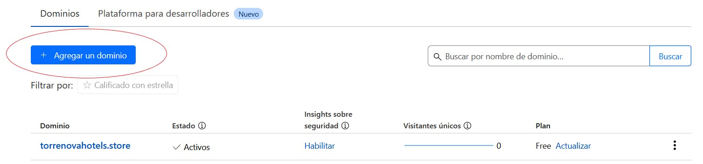
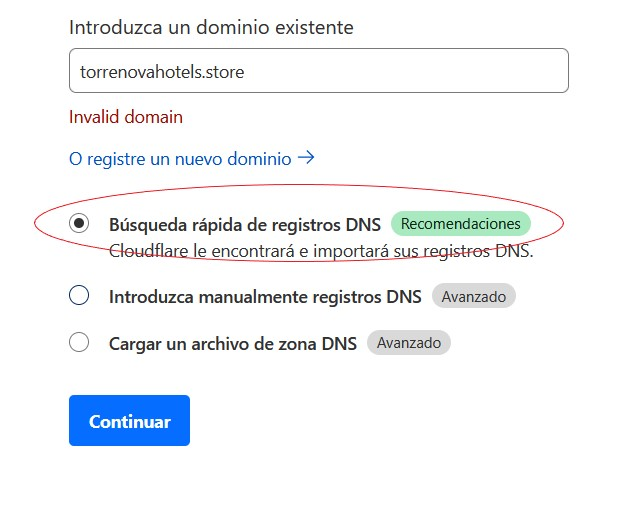
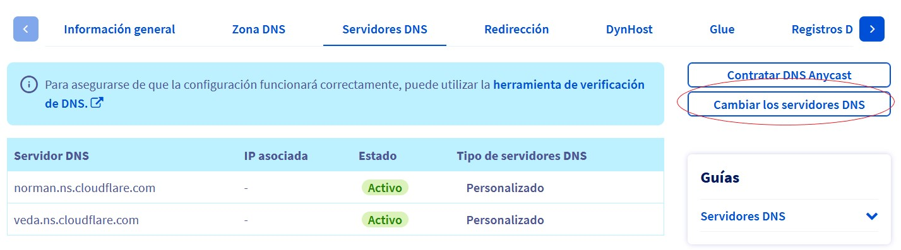

= Guia de configuració

== Configuracio del domini

Primer donarem a Web Cloud on ens sortirà un menú.

Anirem a la part on posa Dominis i triarem l'opció de “torrenovahotels.store” que és el nom del nostre domini.

Anirem a la pestanya que posa Zona DNS.

Buscarem el DNS de tipus A on posa www.torrenovahotels.store i us donarem a Modificar el registre.

A la part de Subdomini us donarem el nom que vulguem a la nostra pàgina, ia destinació apuntarem a l'adreça IP que ens ha proporcionat el servidor. Com volem tenir dos Subdominis repetirem la mateixa acció a l'altre registre DNS.

== Configuració de Cloudflare

Entrarem al CloudFlare i donarem al botó d'Agregar un domini.

Posarem el nostre domini i donarem a cerca ràpida on ens donarà diverses opcions, triarem la gratuïtat, com ja ho vaig fer no puc mostrar una captura.

A sevidors DNS d'on tenim allotjat el nostre domini anirem a Canviar els servidors DNS i donarem nom als nostres servidors DNS jo i els tinc coneguts perquè ens vagi a Cloudflare.

Per acabar tornarem a Cloudflare a la zona de registres i anirem on tenim la nostra IP elàstica us donarem a editar, i on posa nom obligatori posarem la direcció DNS del nostre domini de la nostra aplicació i la nostra web perquè ens redirroja.

image::../imatges/Cloud4.jpg[]