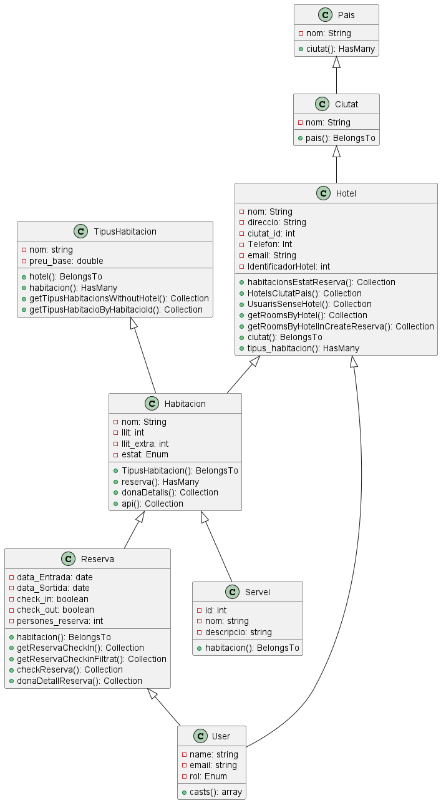
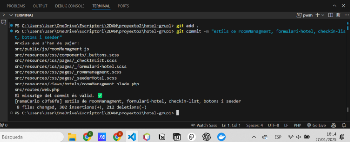

= ABP Projecte 2 Hotels - Grup1

== Introducció

*Nom*

Torrenova

*Membres*  

- Adrian Bernabeu Malia

- Brian Tobias Arrua Dominguez

- Carlo Torres Roca

- Manuel Ordoñez Gomez

=== Objectius de l'aplicació
L'objectiu d'aquest projecte es tenir un sistema de gestió per una cadena hotelera, dissenyat per optimitzar les operacions internes dels hotels i oferir una experiència fluida als clients que fan reserves en línia.

=== Base de dades

==== Diagrama Relacional

==== Diagrama de Classes

// [plantuml, classes-diagrama, png]
// ----
// @startuml
// class Hotel {
//   - nom: String
//   - direccio: String
//   - ciutat_id: int
//   - Telefon: Int
//   - email: String
//   - IdentificadorHotel: int
//   + habitacionsEstatReserva(): Collection
//   + HotelsCiutatPais(): Collection
//   + UsuarisSenseHotel(): Collection
//   + getRoomsByHotel(): Collection
//   + getRoomsByHotelInCreateReserva(): Collection
//   + ciutat(): BelongsTo
//   + tipus_habitacion(): HasMany
// }
// class Ciutat {
//   - nom: String
//   + pais(): BelongsTo
// }
// class Pais {
//   - nom: String
//   + ciutat(): HasMany
// }
// class Reserva {
//   - data_Entrada: date
//   - data_Sortida: date
//   - check_in: boolean
//   - check_out: boolean
//   - persones_reserva: int
//   + habitacion(): BelongsTo
//   + getReservaCheckIn(): Collection
//   + getReservaCheckinFiltrat(): Collection
//   + checkReserva(): Collection
//   + donaDetallReserva(): Collection
// }
// class Servei {
//   - id: int
//   - nom: string
//   - descripcio: string
//   + habitacion(): BelongsTo
// }
// class TipusHabitacion {
//   - nom: string
//   - preu_base: double
//   + hotel(): BelongsTo
//   + habitacion(): HasMany
//   + getTipusHabitacionsWithoutHotel(): Collection
//   + getTipusHabitacioByHabitacioId(): Collection
// }
// class User {
//   - name: string
//   - email: string
//   - rol: Enum
//   + casts(): array
// }
// class Habitacion {
//   - nom: String
//   - llit: int
//   - llit_extra: int
//   - estat: Enum
//   + TipusHabitacion(): BelongsTo
//   + reserva(): HasMany
//   + donaDetalls(): Collection
//   + api(): Collection
// }
// Pais <|-- Ciutat
// Ciutat <|-- Hotel
// Hotel <|-- Habitacion
// Hotel<|-- User
// TipusHabitacion <|-- Habitacion
// Habitacion <|-- Servei
// Habitacion <|-- Reserva
// Reserva <|-- User
// @enduml
// ----

=== Figma
link:https://www.figma.com/design/TFTZ9wGmUbQwclwz17KroX/Torrenova---Grup1?node-id=0-1&node-type=canvas&t=bV4tXxCOiN7z8fDb-0[R01: guia d'estils i mockups a Figma]

=== Manual instalació server AWS

include::R03AWS.adoc[]

==== Linies futures
En quant a línies futures, podríem haver fet tot el segon Sprint de /web, i haver acabat de pulir diverses coses de l'Sprint 1, que a causa de la falta de temps, no hem pogut acabar o fer-les degudament o tal com ens hagués agradat. 
També ens hagués agradat millorar el disseny, ser més curosos en quant a la qualitat del codi, optimitzar i refactoritzar codi en cas de que fos necessari i haver fet més proves de l'aplicació.

==== Requisits no funcionals: T06. Eines per millorar la qualitat del projecte.

===== Instal·lació i configuració d'ESLint:
Per instal·lar ESLint, hem d'executar la comanda npm init @eslint/config@latest, dins de la carpeta /src.
Ens preguntarà per si volem utilitzar ESLint per només errors sintàtics, o per també errors de codi, escollim l'opció que fa les dues 'problems'.

En segon lloc, ens preguntarà quina mena de mòduls vols utilitzar en el teu projecte, i per les nostres necessitats, escollim l'opció 'script'.

Després, ens preguntarà per quin framework utilitzem al nostre projecte, al no utilitzar-ne cap, hi posem l'opció de 'none', en cas d'utilitzar algún framework com per exemple Vue, React, Angular, entre d'altres, hauriem d'escollir l'opció del framework emprat.

A continuació, ens pregunta si el nostre projecte utilitza typescript, al no utilizar-lo, hi posem 'javascript'.

Seguidament, ens pregunta on s'executa el nostre codi, al executar-se al navegador web, escollim 'browser'.

Per últim, després d'haver fet aquests passos, ens diu que la configuració que hem escollit, necessita unes dependencies especifiques, les instal·lem i per últim ens pregunta quin package manager volem utilitzar, i escollim npm.

Un cop fet això, ja tenim ESLint instal·lat al nostre projecte.

===== Instal·lació i configuració de git hooks amb husky:
Per instal·lar husky, hem de posar-nos a la carpeta on vulguem instalar-ho, en el nostre cas, a /src, i executar la següent comanda: 
----
# npm install husky --save-dev
----

Fem un ls .git/hooks/ per tal de veure tots els arxius del husky.

Llavors, utilitzarem la comanda init per simplificar la configuració de husky, ja que ens crea un fitxer de configuració amb els hooks predefinits, i ens permet afegir els nostres propis hooks.
----
# npx husky-init 
----

Nosaltres al només voler utilitzar els hooks per pre-commit, creem un arxiu script commit-msg.sh a la carpeta .husky, i afegim l'script que volem executar abans de fer commit:
----
# #!/bin/sh

# Obtenim el missatge del commit desde l'arxiu que es passa
commit_msg_file=$1
commit_msg=$(cat "$commit_msg_file")

# Verifiquem si el missatge té menys de 12 caràcters 
if [ ${#commit_msg} -lt 12 ]; then
  echo "El missatge del commit ha de tindre 12 caràcters com a mínim. ❌"
  exit 1
fi

echo "El missatge del commit és vàlid. ✅"
----

Aquí el resultat:

Un cop fetes aquestes passes, ja tens husky instal·lat i configurat al teu projecte.

===== Instal·lació i configuració de psalm:
Per instal·lar psalm de PHP, hem d'executar la comanda: 

#composer require --dev vimeo/psalm.

Un cop instal·lat, per inicialitzar-ho, hem d'executar la comanda:
#./vendor/bin/psalm --init

Configurem l'error level a '3', sent '1' el més restrictiu, i sent '8' el més permissiu.

Per últim, per analitzar i executar el fitxer psalm creat (psalm.xml), hem d'executar la comanda:
#./vendor/bin/psalm

[TIP]
===== Comandes interessants de psalm:
====
----
# ./vendor/bin/psalm --diff
Per analitzar només fitxers modificats, i aíxi ser més ràpid.

# ./vendor/bin/psalm --watch
executar psalm en mode watch per analitzar automàticament el codi que modifiques.

----

====

== Webgrafia

=== Disseny

- **Framer**: Plataforma per al disseny interactiu.
   https://www.framer.com/

- **The Good Line Height**: Eina per calcular l'altura de línia òptima.
   https://thegoodlineheight.com/

==== Icones per a la web

- **Streamline Icons**: Col·lecció extensa d'icones per a disseny web.
   https://www.streamlinehq.com/

- **Heroicons**: Conjunt d'icones gratuïtes i de codi obert.
   https://heroicons.com/

- **Lucide**: Icones simples i consistents per a projectes web.
   https://lucide.dev/

- **Eva Icons**: Paquet d'icones amb disseny atractiu.
   https://akveo.github.io/eva-icons/

- **Iconmonstr**: Biblioteca d'icones gratuïtes i senzilles.
   https://iconmonstr.com/

=== Logotips

- **Design.com Logo Maker**: Eina per crear logotips personalitzats.
   https://www.design.com/maker/logos/

- **Logggos.club**: Plataforma per generar logotips de manera senzilla.
   https://www.logggos.club/

- **Logo Ipsum**: Generador de logotips de mostra per a projectes.
   https://logoipsum.com/

- **LogoSystem**: Sistema per dissenyar i descarregar logotips.
   https://logosystem.co/

- **Squish**: Eina per crear logotips minimalistes.
   https://squish.addy.ie/

=== SASS

- **Sass-lang**: Pàgina oficial de Sass, el preprocesador de CSS.
   https://sass-lang.com/

- **MDN Web Docs**: Documentació sobre elements i propietats CSS.
   https://developer.mozilla.org/en-US/docs/Web/HTML/Element/input/radio
   https://developer.mozilla.org/en-US/docs/Web/CSS/text-overflow
   https://developer.mozilla.org/en-US/docs/Web/CSS/overflow
   https://developer.mozilla.org/en-US/docs/Web/CSS/flex-basis
   https://developer.mozilla.org/en-US/docs/Web/CSS/easing-function
   https://developer.mozilla.org/en-US/docs/Web/CSS/CSS_animations/Using_CSS_animations
   https://developer.mozilla.org/en-US/docs/Web/CSS/grid-template-columns

- **CSS-Tricks**: Article sobre enfocaments per a media queries en Sass.
   http://css-tricks.com/approaches-media-queries-sass/

- **Medium**: Guia sobre com aprofitar els mixins de SCSS per crear dissenys responsius.
   https://medium.com/@jainbhavukspeaks/leveraging-scss-mixins-to-create-responsive-layouts-the-easy-way-5bbe4080cb15

- **Dev.to**: Tutorial sobre com escriure media queries amb mixins en Sass.
   https://dev.to/rembertdesigns/how-to-write-media-queries-with-sass-mixins-32e

=== T06: Eines per millorar el projecte (ESLint, Husky i Psalm)

- **ESLint Vue.js**: Regles i guia d'usuari per a ESLint en Vue.js.
   https://eslint.vuejs.org/rules/
   https://eslint.vuejs.org/user-guide/

- **ESLint Oficial**: Documentació sobre configuració de regles en ESLint.
   https://eslint.org/docs/latest/use/configure/rules

- **Dev.to**: Article sobre com fer que ESLint funcioni en Vue 3.
   https://dev.to/drfcozapata/como-hacer-que-eslint-9111-funcione-en-vue-3-26b0

- **Regles específiques d'ESLint Vue.js**:
   https://eslint.vuejs.org/rules/multi-word-component-names.html
   https://eslint.vuejs.org/rules/attributes-order.html
   https://eslint.vuejs.org/rules/order-in-components.html
   https://eslint.vuejs.org/rules/html-self-closing.html

==== Husky

- **Husky**: Guia per començar amb Husky.
   https://typicode.github.io/husky/#/

- **YouTube**: Tutorial sobre com configurar Husky en projectes.
   https://www.youtube.com/watch?v=1OFiiPretCM

- **YouTube**: Vídeo explicatiu sobre l'ús de Husky.
   https://www.youtube.com/watch?v=YWBrzwSDpo8

==== PHP Psalm

- **Psalm**: Documentació sobre la instal·lació i ús de Psalm.
   https://psalm.dev/docs/running_psalm/installation/

=== Vue

- **Vue CLI**: Guia d'instal·lació de Vue.
   https://cli.vuejs.org/guide/installation.html

- **YouTube**: Tutorial sobre com integrar Mailtrap amb Vue.
   https://www.youtube.com/watch?v=iioJ2GNXbW0

- **YouTube**: Curs complet per a principiants sobre Vue.js.
   https://www.youtube.com/watch?v=VeNfHj6MhgA

==== API REST

- **RapidAPI**: Plataforma per descobrir i connectar amb APIs.
   https://rapidapi.com/

- **YouTube**: Tutorial sobre com consumir una API REST amb JavaScript i Fetch.
   https://www.youtube.com/watch?v=FJ-w0tf3d_w

=== Laravel

- **YouTube**: Curs complet de Laravel per a principiants.
   https://www.youtube.com/watch?v=ImtZ5yENzgE

- **Laravel**: Pàgina oficial del framework Laravel.
   https://laravel.com/

=== Figma

- **YouTube**: Tutorial sobre Auto Layout a Figma.
   https://www.youtube.com/watch?v=42uQGucQA9o

- **YouTube**: Tutorial sobre Responsive Design a Figma.
   https://youtu.be/gwiX0oASlEw?si=gPsLGne8tcgkHr6p

- **Shift Nudge**: Curs introductori a Figma.
   https://shiftnudge.com/figma/101

=== AWS

==== Docker a AWS

- **Cursos de Desenvolupament**: Instal·lació de Docker a Ubuntu 24.04 LTS.
   https://cursosdedesarrollo.com/2024/04/instalacion-de-docker-en-ubuntu-24-04

- **YouTube**: Guia pas a pas per instal·lar Docker a Ubuntu 24.04 LTS.
   https://www.youtube.com/watch?v=zQyrhjEAqLs&t=1198s

- **YouTube**: Com configurar una instància EC2 i instal·lar Apache i PHP.
   https://www.youtube.com/watch?v=TZeHIFqMAkM

- **Documentació d'AWS**: Instal·lar un servidor web en una instància EC2.
   https://docs.aws.amazon.com/AmazonRDS/latest/UserGuide/CHAP_Tutorials.WebServerDB.CreateWebServer.html

- **YouTube**: Tutorial sobre la configuració d'IP elàstica i domini en AWS.
   https://youtu.be/7K7SsOl8CJ4?si=LwhncCACsfWiEZ3k

- **Composer**: Descàrrega i instal·lació de Composer.
   https://getcomposer.org/download/

===== IP elàstica

- **Documentació d'AWS**: Informació sobre les adreces IP elàstiques.
   https://docs.aws.amazon.com/es_es/AWSEC2/latest/UserGuide/elastic-ip-addresses-eip.html

- **Laracasts**
   https://laracasts.com/discuss/channels/code-review/unable-to-locate-a-class-or-view-for-component

===== Altres eines (IA)

- **ChatGPT**
   https://chatgpt.com/

- **DeepSeek**
   https://chat.deepseek.com/

- **GitHub Copilot**
   https://github.com/features/copilot

=== Conclusions

==== Conclusió individual
Carlo Torres:

Tot i les dificultats trobades durant el llarg del projecte i el desconeixement previ que tenia dels llenguatges o frameworks com laravel, SASS i Vue, he après molt sobre ells i he pogut aplicar-los en un projecte real. A més, he millorat la meva comunicació amb els meus companys i a resoldre problemes de manera conjunta. També he après a utilitzar eines com Figma d'una millor manera en comparació amb el primer projecte i eines o software com AWS, ESLint, husky i psalm, els quals no havia utilitzat mai, de fet ni els coneixia.
És cert que obviàment, el meu  coneixement d'aquests frameworks no es avançat, però crec que he pogut aportar el meu gra de sorra al projecte i ajudar als meus companys en la mesura del possible.
Per tant, doncs tot i les dificultats que han anat sortint durant la meva part del projecte, estic content amb el resultat final i amb el que he après, i el fet d'haver pogut ajudar als companys i que ells m'ajudessin a poder duu a terme les meves parts.

Brian Tobias:

La part on jo vaig tenir molts problemes en més en la part de pujar les coses en el git que comparant-lo amb altres projectes vaig tenir molts conflictes, crec que amb el que he tocat de Vue m'ha interessat molt tot i que hi havia vegades al ser diferent de JS em va costar, per la part de Laravel vaig aprendre molt, les coses que té, també en aquest projecte vaig aprendre molt de l'api que avanç no l'havia tocat tant.

Manuel Ordoñez:

Tot i les dificultats i ser la primera vegada que treballava amb laravel o vue, ha estat una gran experiència i m'ha servidor per aprendre força. Si que és cert que es podrien haver fet les conses d'una manera millor i més eficient, però malgrat tot estic content amb el resultat optat.

Adrian Bernabeu:

Aquest projecte m'ha servit per millorar la comunicació en grup i també amb els llenguatges de Laravel i Vue. Les úniques dificultats que he notat han estat amb l'organització de les tasques i la comunicació, perquè a l'hora de pujar els canvis a develop ens apareixien bastants conflictes. Però, a part d'això, hem treballat tots bé.

==== Conclusió grupal
Hem arribat fins al Sprint 1 de la /web. Hem tingut diversos problemes o setbacks durant el llarg del projecte, com per exemple problemes amb el temps, problemes amb el codi (pulls i pushes), els quals a vegades no agafava tot el codi canviat, lo qual es traduïa en una pèrdua de temps que podria haver estat invertida a seguir amb el projecte. Tot i això, hem aconseguit arribar fins aquí i estem contents amb el resultat final.

Tot i les ja esmentades dificultats, hem après molt sobre els frameworks i llenguatges utilitzats, així com a utilitzar eines com Figma, AWS, ESLint, husky i psalm. Hem après a treballar en equip i a resoldre problemes de manera conjunta.
